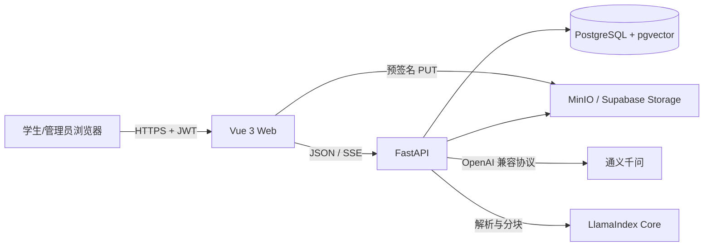
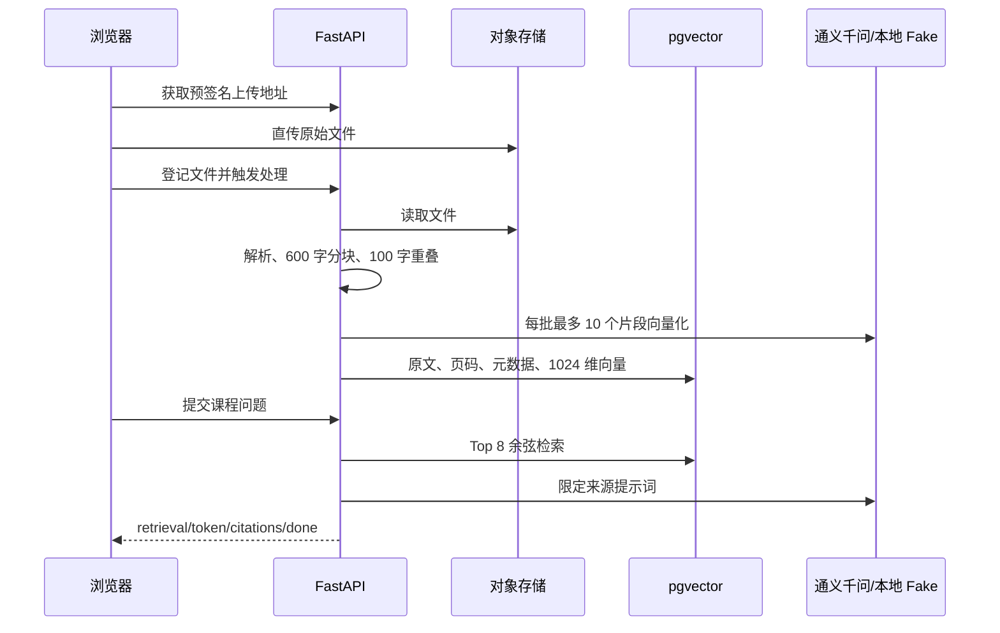
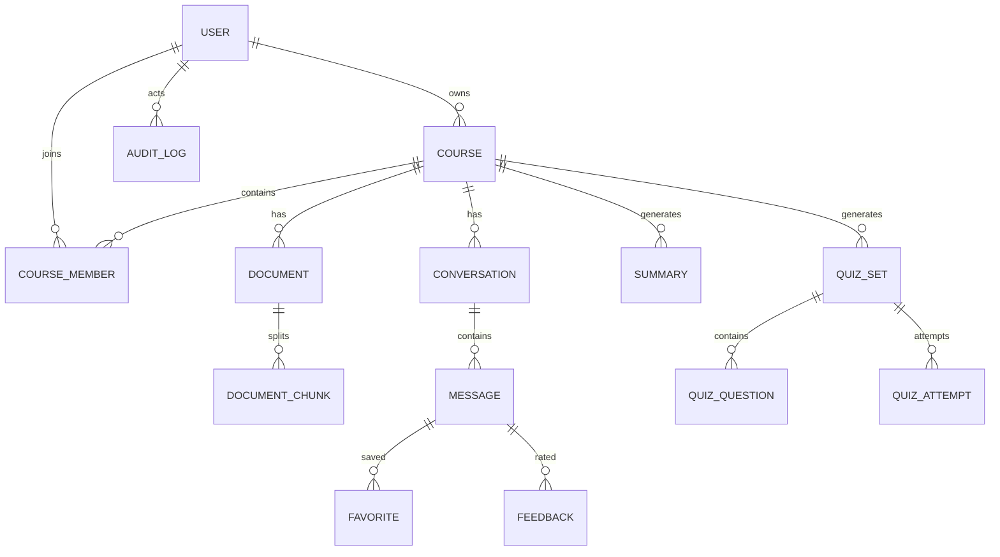

# 系统架构说明

## 运行结构

Vue 只依赖 `/api/v1` 契约。FastAPI 将课程权限、业务服务、AI 提供商和存储适配器分开。文档模块的稳定产物是 `DocumentChunk`；问答、摘要和测验只按课程 ID 消费已就绪片段。

## RAG 数据流

文档只有在所有片段成功写入后才变为 `ready`。重试先清理该文档的旧片段。问答只检索当前课程的 `ready` 文档；引用编号经过服务端校验，找不到达到阈值的材料或答案没有有效引用时返回统一拒答。

## 主要实体关系

所有主键使用 UUID 字符串，时间以 UTC 存储。课程成员关系是课程数据访问的唯一入口，管理员拥有平台级管理权限。

## 失败处理

- API 错误返回稳定 `code`、中文 `message` 和 `request_id`。
- DashScope 失败时保存用户问题并通过 SSE `error` 事件返回可重试错误。
- 上传校验扩展名、大小和 SHA-256，课程内相同内容拒绝重复登记。
- 文档处理状态记录错误原因；管理员可以幂等重试。
- Refresh Token 只保存摘要，可撤销，Access Token 生命周期为 30 分钟。
